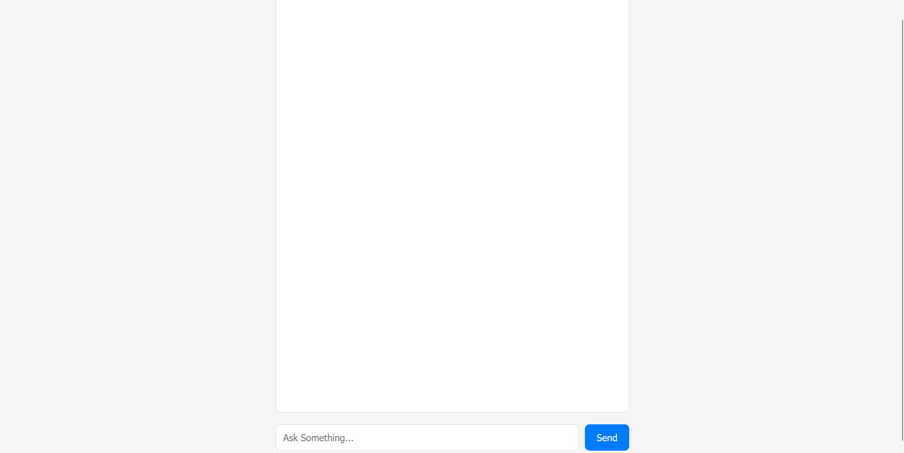
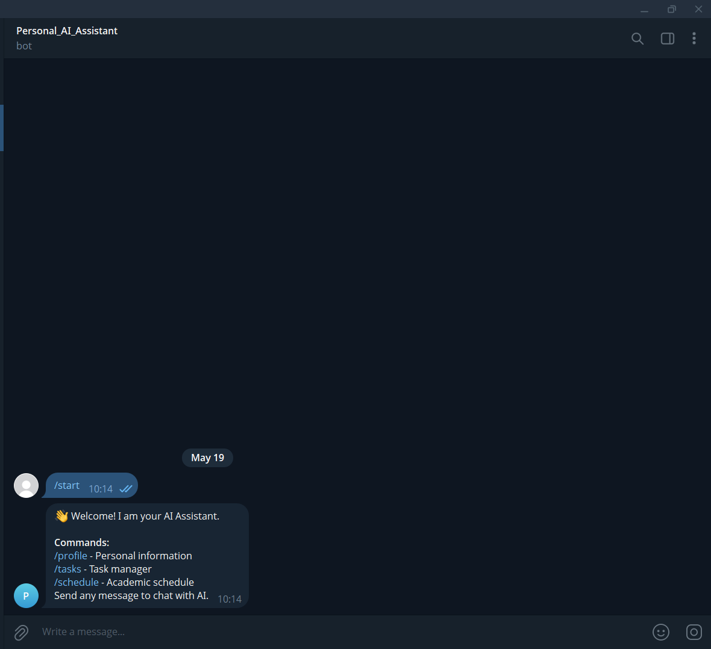

# 🤖 Personal AI Assistant

A personal AI assistant with a dual interface: a Django web chat and an Aiogram Telegram bot.
Both interfaces connect to a locally hosted language model via LM Studio.

---

## 📋 Project Description

This project is a **Hybrid Chatbot** that lets the user communicate with a local LLM through
two independent channels simultaneously:

- **Web Interface** — browser-based chat available at `http://localhost:8000`
- **Telegram Bot** — fully functional bot with `/profile`, `/tasks`, and `/schedule` commands

The system stores conversation history, user profile, task list, and schedule in a SQLite
database. Both interfaces run concurrently within a single Django process.

All sensitive configuration (API tokens, secret keys, server URLs) is stored exclusively in
a `.env` file that is never committed to the repository.

---

## 🛠 Technologies Used

| Component       | Technology                        |
| --------------- | --------------------------------- |
| Backend         | Python 3.11+, Django 4.x          |
| Telegram Bot    | Aiogram 3.x                       |
| LLM Integration | LM Studio (local REST API)        |
| HTTP Requests   | Requests                          |
| Database        | SQLite3                           |
| Concurrency     | Threading + AsyncIO               |
| Frontend        | HTML, CSS, Vanilla JS (Fetch API) |
| Environment     | python-dotenv, os                 |

---

## 📁 Project Structure

```
personal_ai_assistant_v3/
│
├── manage.py
├── requirements.txt
├── .env.example                      # template — copy to .env and fill in
├── .gitignore                        # excludes .env, db.sqlite3, venv/, __pycache__/
│
├── personal_ai_assistant_v3/         # Django configuration
│   ├── settings.py                   # loads secrets via os.getenv()
│   ├── urls.py
│   ├── wsgi.py
│   └── asgi.py
│
└── bot_app/                          # main application
    ├── apps.py                       # launches Telegram bot in background thread
    ├── views.py                      # web logic + AiManagerMaster class
    ├── tg_bot.py                     # Telegram bot handlers
    ├── models.py
    ├── migrations/
    └── templates/
        └── chat.html                 # web chat interface
```

> `db.sqlite3` is created automatically on first run and is excluded from version control.

---

## ⚙️ Installation

### 1. Clone the repository

```bash
git clone https://github.com/<your-username>/personal_ai_assistant_v3.git
cd personal_ai_assistant_v3
```

### 2. Create and activate a virtual environment

```bash
python -m venv venv

# Windows
venv\Scripts\activate

# macOS / Linux
source venv/bin/activate
```

### 3. Install dependencies

```bash
pip install -r requirements.txt
```

### 4. Configure environment variables

```bash
# Copy the template
cp .env.example .env
```

Open `.env` and fill in your values:

```env
TELEGRAM_BOT_TOKEN=your_token_here
DJANGO_SECRET_KEY=your_secret_key_here
LM_STUDIO_URL=http://localhost:1234/v1/chat/completions
LM_STUDIO_PORT=1234
```

> ⚠️ **Never commit `.env` to git.** It is already listed in `.gitignore`.
> The application reads all secrets at runtime via `os.getenv()`.

### 5. Apply migrations

```bash
python manage.py migrate
```

### 6. Set up LM Studio

- Download and install [LM Studio](https://lmstudio.ai/)
- Load any compatible model (recommended: `Mistral 7B` or `LLaMA 3`)
- In the **Local Server** tab, start the server on port `1234`
- Confirm the endpoint is reachable: `http://localhost:1234/v1/chat/completions`

---

## 🚀 Running the Project

```bash
python manage.py runserver
```

Once started:

- **Web chat** is available at: [http://localhost:8000](http://localhost:8000)
- **Telegram bot** starts automatically in a background thread

> ⚠️ LM Studio must be running **before** starting the Django server,
> otherwise the bot will return: `Server Offline: LM Studio is not running!`

---

## 💬 Usage Examples

### Web Interface

```
User:      Hello! What can you help me with?
Assistant: Hi! I'm your personal AI assistant. I can answer questions,
           help manage your tasks, and hold a conversation.

User:      Explain what asyncio is in Python.
Assistant: asyncio is a library for writing concurrent code using
           the async/await syntax...
```

### Telegram Bot

| Command       | Description                                         |
| ------------- | --------------------------------------------------- |
| `/start`      | Welcome message and list of available commands      |
| `/profile`    | Displays the user's personal data from the database |
| `/tasks`      | Task list with completion status ✅ / ⏳            |
| `/schedule`   | Academic timetable                                  |
| _any message_ | Response from the local LLM                         |

```
/tasks
✅ Submit lab report #3
⏳ Prepare the presentation
⏳ Read the asyncio chapter
```

---

## 🔧 Error Handling

The system gracefully handles the following situations:

- **Empty input** — returns `400 Bad Request` with a description
- **LM Studio offline** — returns a clear error message instead of crashing
- **Model connection error** — caught via `try/except`, response includes the error detail
- **Unknown Telegram command** — bot suggests using `/start`
- **Wrong HTTP method** — API returns `405 Method Not Allowed`

---

## 🗄 Data Storage

All data is stored in `db.sqlite3` (auto-created, excluded from git):

| Table          | Purpose                                           |
| -------------- | ------------------------------------------------- |
| `chat_logs`    | Conversation history (user message + AI response) |
| `user_profile` | User profile stored as key-value pairs            |
| `tasks`        | Task list with completion status                  |
| `schedule`     | Academic timetable organized by day               |

All tables are created automatically on first run via `_init_table()`.

---

## 🔐 Security Notes

- All secrets are loaded at runtime through `os.getenv()` (standard library `os` module)
  and `python-dotenv` — no credentials are hardcoded in source files
- `.env` is listed in `.gitignore` and must **never** be committed
- `db.sqlite3` is also excluded — it may contain personal conversation history
- Use `.env.example` as the only reference for required variables

---

## 📦 requirements.txt

```
django>=4.2
aiogram>=3.0
requests>=2.31
python-dotenv>=1.0
```

---

## 📸 Screenshots

### Web Chat Interface



### Telegram Bot



---

## 👤 Author

Project developed as part of the **"Programming In Python Language"** course.
